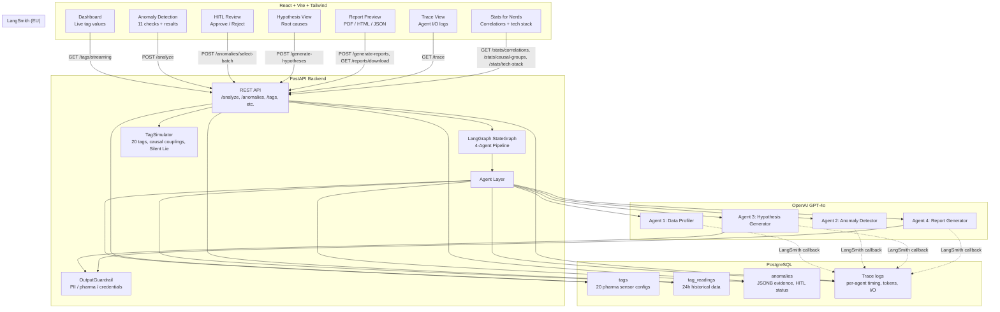
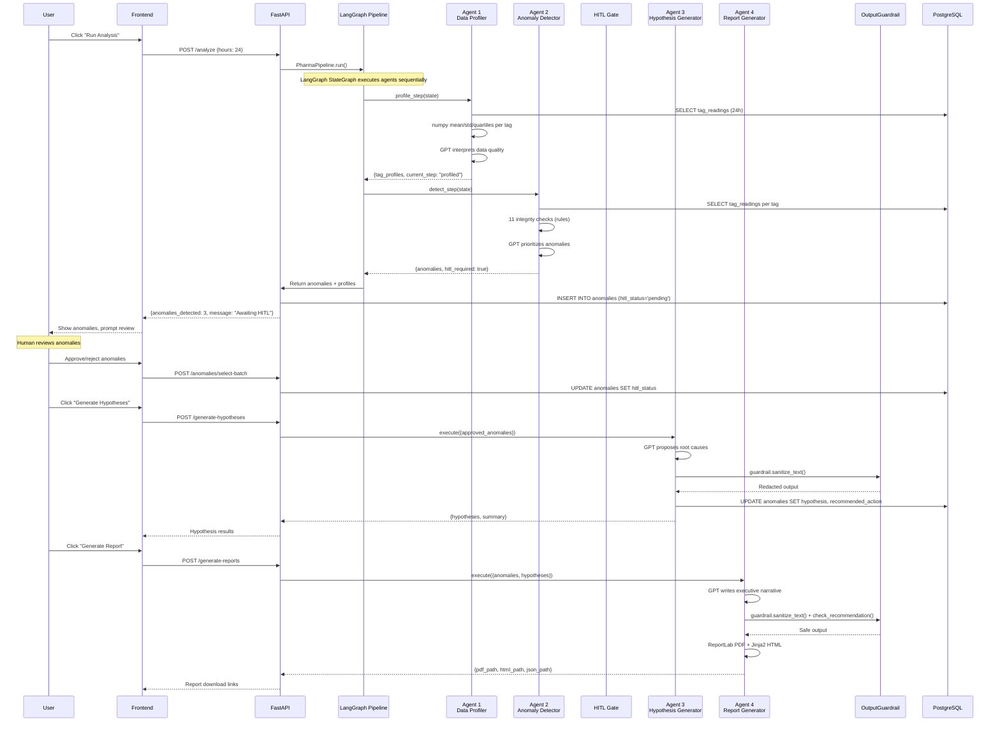
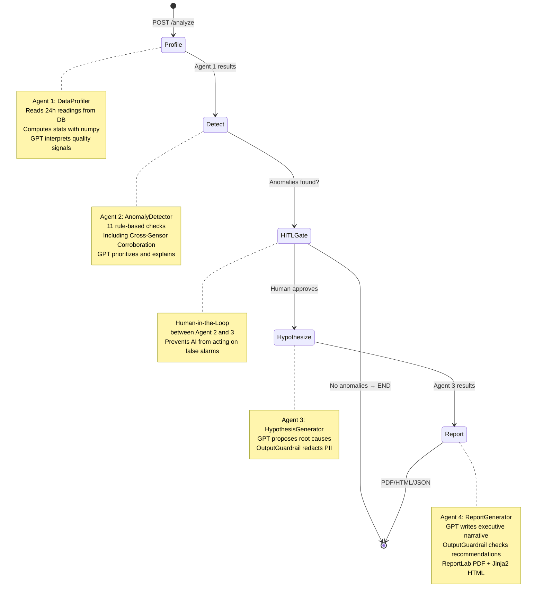
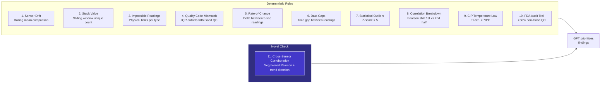
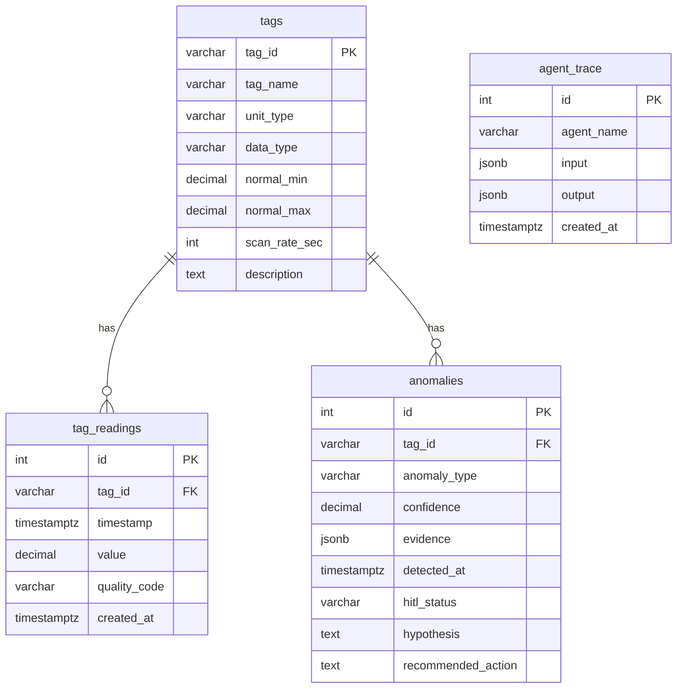
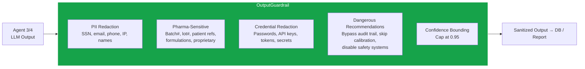
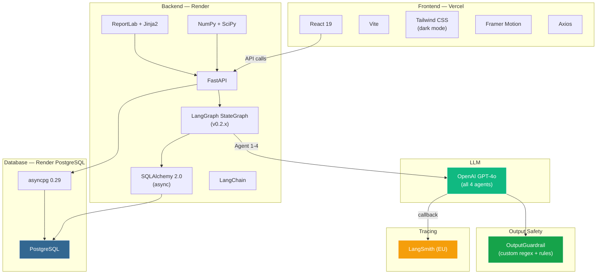
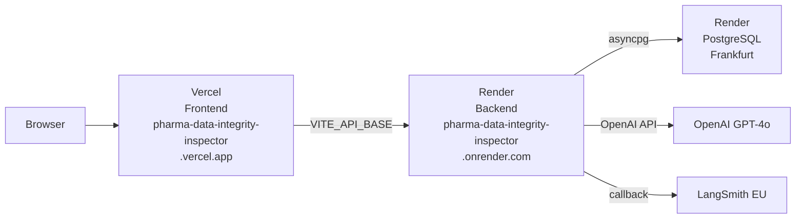

# Pharma Data Integrity Inspector — Architecture

## System Overview

## Data Flow (Step by Step)

## 4-Agent Pipeline (LangGraph)

## 11 Integrity Checks

## Cross-Sensor Corroboration (Check 11)

## TagSimulator Causal Groups

## Database Schema

## OutputGuardrail

## Tech Stack

## Deployment

