# Pharma Data Integrity Inspector — Architecture

## System Overview

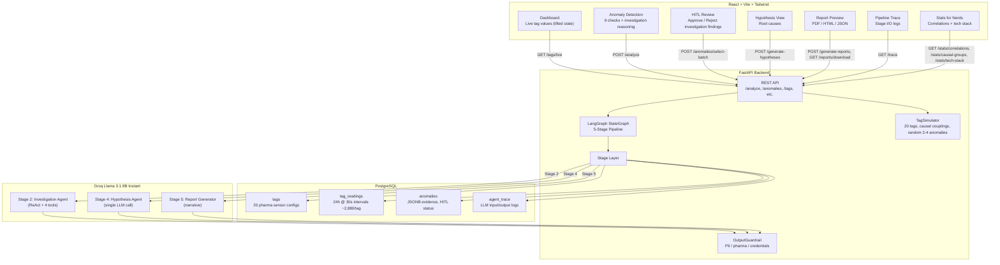

## Data Flow (Step by Step)

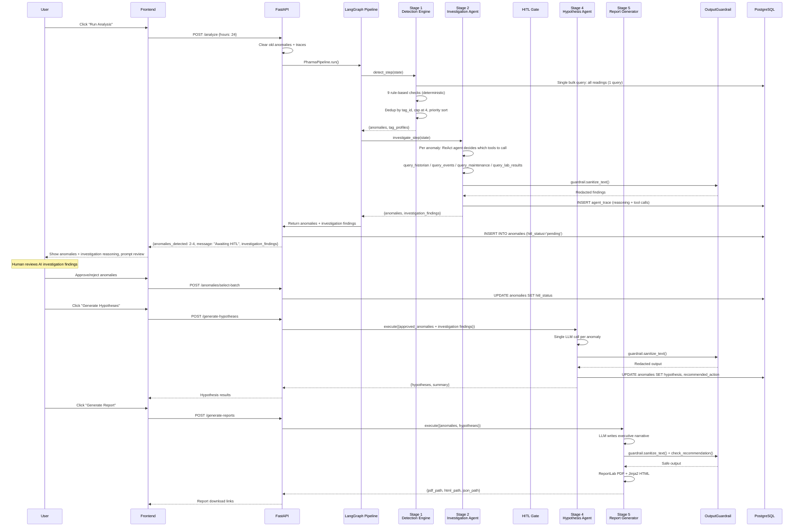

## 5-Stage Pipeline (LangGraph)

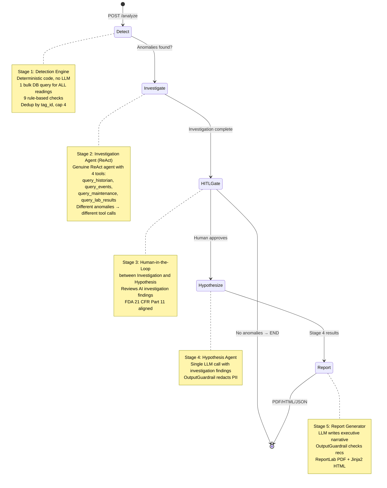

## 9 Active Integrity Checks

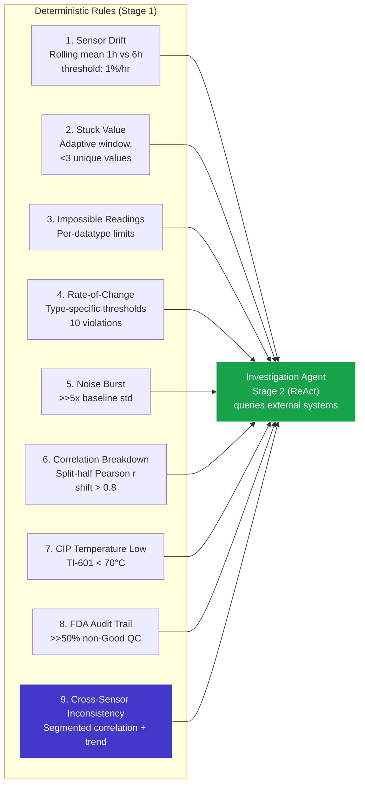

## Cross-Sensor Corroboration (Check 9)

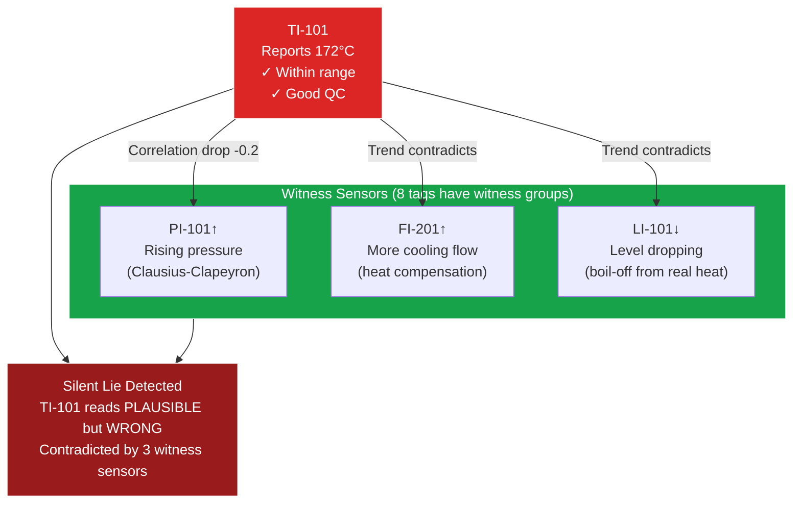

## Investigation Agent Tools (Stage 2)

The Investigation Agent is a genuine ReAct agent — different anomaly types lead to different tool call sequences:

| Tool | Simulated System | What It Returns | When Called |
|------|-----------------|----------------|------------|
| `query_historian` | PI Historian | Trend data, statistics, correlation changes | Drift, correlation breakdown, cross-sensor |
| `query_events` | MES | Batch events, CIP cycles, operator actions | CIP issues, rate-of-change, impossible readings |
| `query_maintenance` | CMMS | Calibration history, work orders, sensor replacement | Stuck values, drift, noise burst |
| `query_lab_results` | LIMS | Lab sample results, batch quality, analytical data | Cross-sensor, silent lie, quality issues |

The LLM decides which tools to call based on the anomaly type. For example:
- **Stuck value** → `query_maintenance` (is it a broken transmitter?) → `query_historian` (how long stuck?)
- **Cross-sensor inconsistency** → `query_historian` (trend analysis) → `query_lab_results` (confirm with lab data)
- **CIP temperature low** → `query_events` (CIP cycle status) → `query_maintenance` (heater calibration?)

## Tag Simulator Anomaly Pool

2-4 random anomalies are injected per reseed from a pool of 6 templates:

| Type | Example Tags | What It Does |
|------|-------------|-------------|
| `sensor_drift` | TI-101, PI-101, PI-502 | Gradual drift at 1-5%/hr or 0.5-2% for flow/pressure |
| `stuck_value` | VI-301, PI-401, FI-101 | Value frozen for 2-8 hours |
| `spike` | TI-101, PI-101, AI-901 | Sudden 3-8x multiplier, 1-3 data points |
| `noise_burst` | TI-201, VI-301, AI-901 | 3-8x noise for 1-4 hours |
| `silent_lie` | TI-101, TI-201, PI-101 | 2-6% offset with Good quality code (the novel check) |
| `sensor_drift` (slow) | PI-502, FI-601 | Slow drift at 0.5-2% (harder to detect) |

No tag overlap: each tag can only have one anomaly. Priority sort ensures cross_sensor_inconsistency > sensor_drift > stuck_value > others.

## TagSimulator Causal Groups

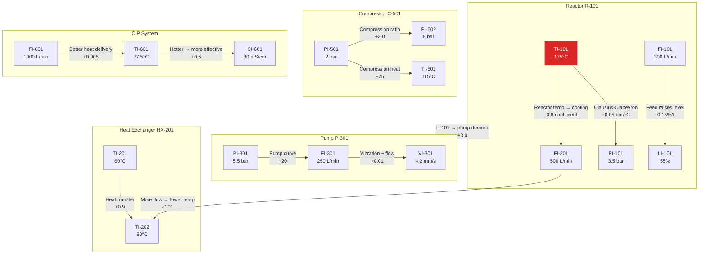

## Performance Architecture

Stage 1 (Detection Engine) is deterministic — no LLM, runs in ~3-4s. Stage 2 (Investigation Agent) uses ReAct with tools at ~2-3s per anomaly. Total ~5-10s for detect+investigate.

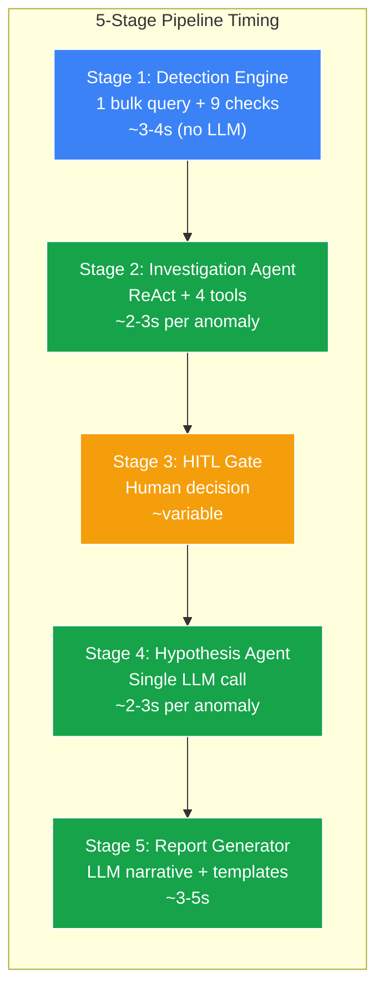

Key optimizations:
- **Detection Engine is code, not AI**: No LLM tokens spent on detection. Deterministic rules ensure 100% coverage and auditability.
- **Single query**: `_load_all_readings()` loads ALL tag readings in one SQL query instead of per-tag loops
- **ReAct investigation**: Agent decides tool calls based on anomaly type — genuine agency, not a fixed lookup
- **Hard cap + dedup**: Max 4 anomalies, dedup by tag_id (keep highest confidence), priority-sorted
- **Token-efficient**: ~3-5K tokens/run total (investigation ~2-3K, hypothesis ~1-2K, report ~300)

## Database Schema

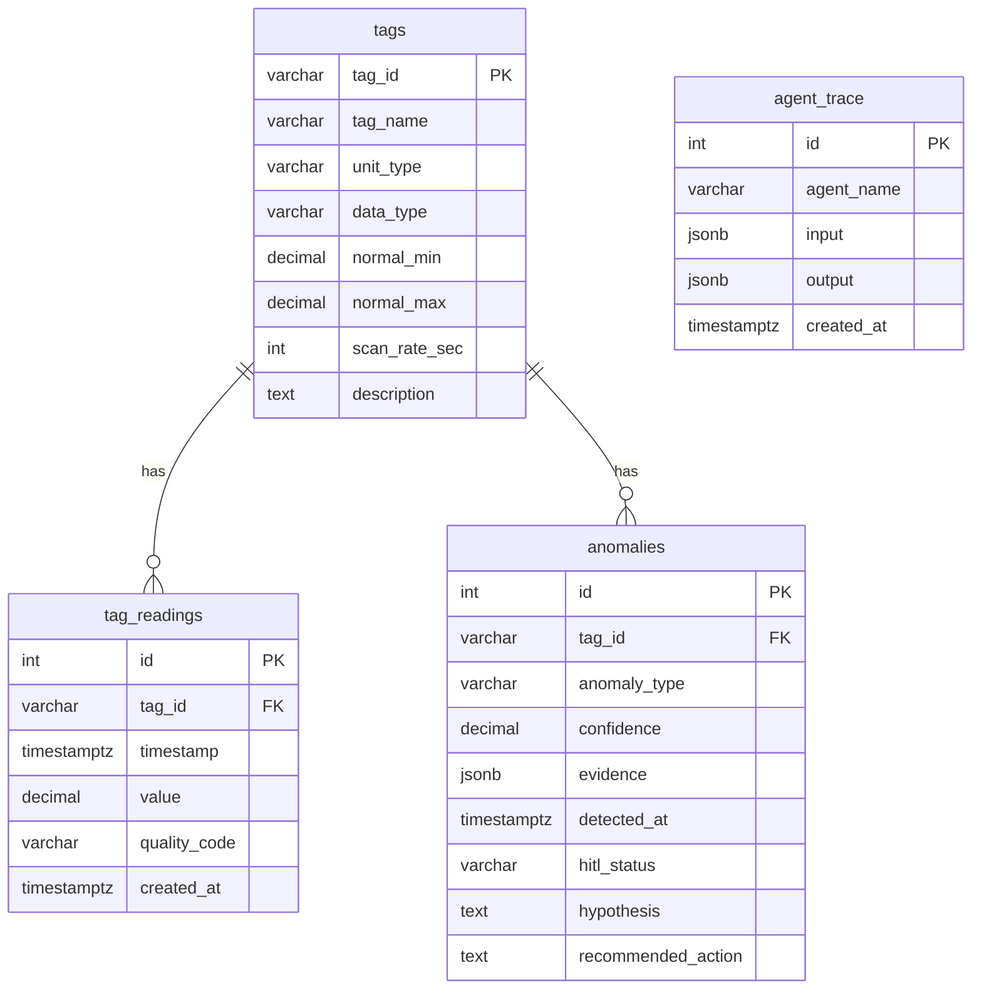

## OutputGuardrail

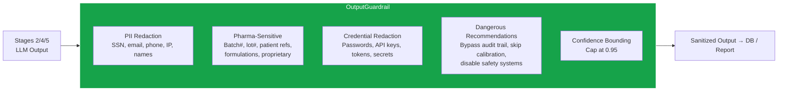

## Tech Stack

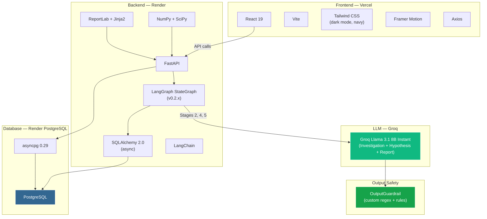

## Deployment

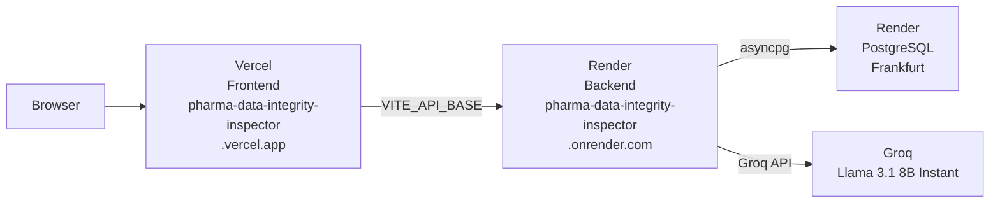